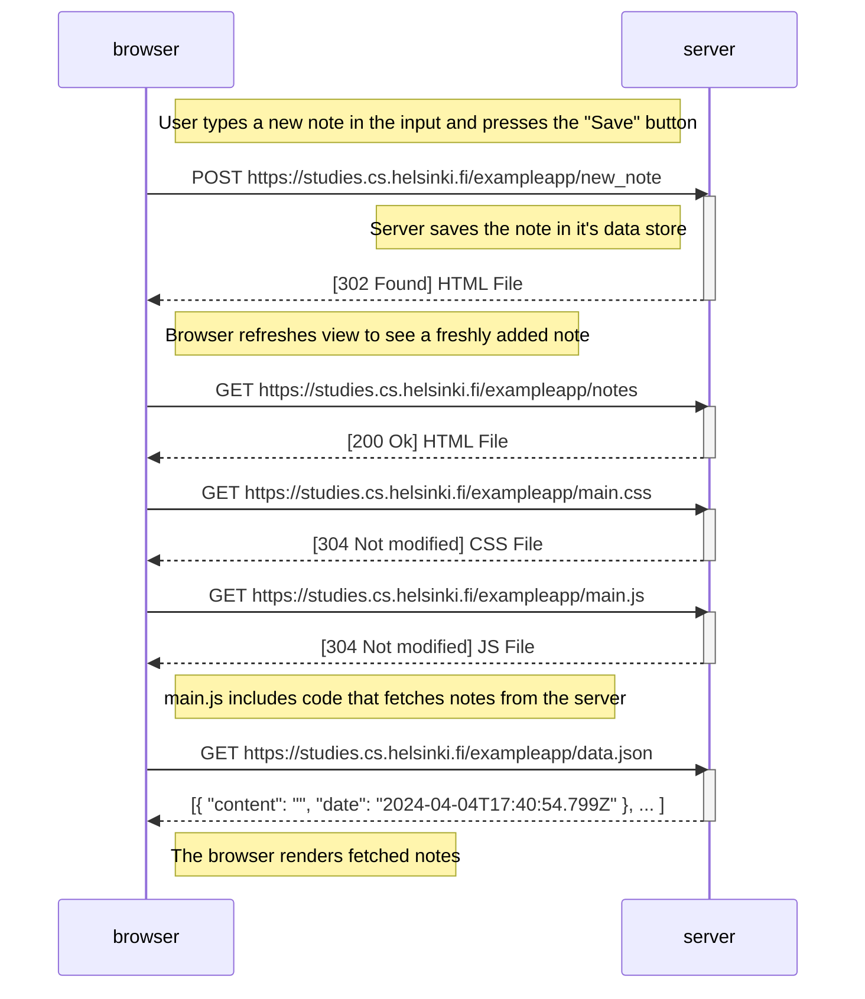

```mermaid
sequenceDiagram
    participant browser
    participant server

    Note right of browser: User types a new note in the input and presses the "Save" button
    browser->>server: POST https://studies.cs.helsinki.fi/exampleapp/new_note
    activate server
    Note left of server: Server saves the note in it's data store
    server-->>browser: [302 Found] HTML File
    deactivate server

    Note right of browser: Browser refreshes view to see a freshly added note
    browser->>server: GET https://studies.cs.helsinki.fi/exampleapp/notes
    activate server
    server-->>browser: [200 Ok] HTML File
    deactivate server

    browser->>server: GET https://studies.cs.helsinki.fi/exampleapp/main.css
    activate server
    server-->>browser: [304 Not modified] CSS File
    deactivate server

    browser->>server: GET https://studies.cs.helsinki.fi/exampleapp/main.js
    activate server
    server-->>browser: [304 Not modified] JS File
    deactivate server

    Note right of browser: main.js includes code that fetches notes from the server
    browser->>server: GET https://studies.cs.helsinki.fi/exampleapp/data.json
    activate server
    server-->>browser: [{ "content": "", "date": "2024-04-04T17:40:54.799Z" }, ... ]
    deactivate server

    Note right of browser: The browser renders fetched notes
```