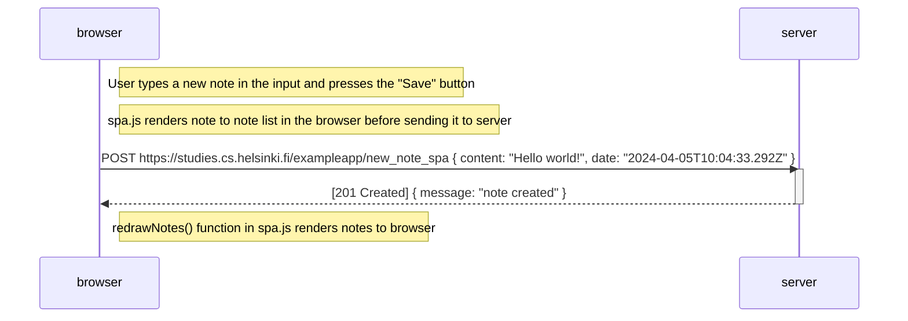

```mermaid
sequenceDiagram
    participant browser
    participant server

    Note right of browser: User types a new note in the input and presses the "Save" button
    Note right of browser: spa.js renders note to note list in the browser before sending it to server
    browser->>server: POST https://studies.cs.helsinki.fi/exampleapp/new_note_spa { content: "Hello world!", date: "2024-04-05T10:04:33.292Z" }
    activate server
    server-->>browser: [201 Created] { message: "note created" }
    deactivate server

    Note right of browser: redrawNotes() function in spa.js renders notes to browser
```